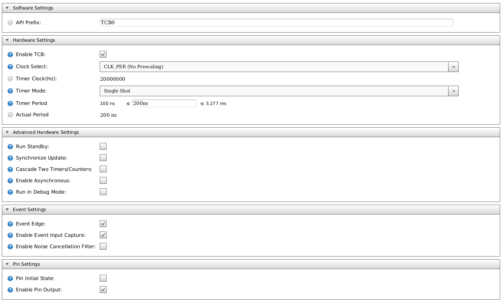
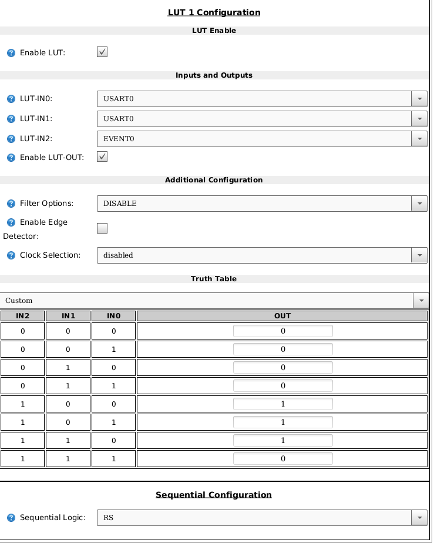
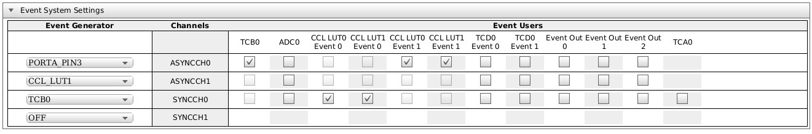

# `ATTINY402` Information


*Figure: Reference design for `ATTINY402`.*


| Pin | Port | Function    | Usage                                             |
| --- | ---- | ----------- | --------------------------------------------------|
| 1   |      | VCC         | 5V                                                |
| 2   | PA6  | LUT0.OUT    | WS2812 Serial Waveform                            |
| 3   | PA7  | AIN7/AINP0  | Analog Keypad                                     |
| 4   | PA1  | TWI.SDA     | TWI (I2C) Data Signal                             |
| 5   | PA2  | TWI.SCL     | TWI (I2C) Clock Signal                            |
| 6   | PA0  | UPDI        | Debug interface.                                  |
| 7   | PA3  | USART.XCK   | USART XCK routed to pin to trigger evsys.         |
| 8   |      | GND         |                                                   |


Currently, the build only support `VDD` at 5V. Need to adjust clock for lower
voltages. Would need to reduce to 10MHz at 3.3V.

Pin 6: UPDI can be repurposed, but recommend leaving as-is.
Pin 7: XCK can be repurposed when USART is inactive.

## Implementation Notes

### Power Management

This section needs to be completed.

See [test & validation](docs/test-validation.md) report for details about power
management. Defaults to standby.

If standby proves unstable, consider enabling idle:

```
#define CONFIG_SLEEP                            DEF_SLEEP_IDLE
```

Another parameter that may be worth changing:

```
#define CONFIG_SLEEP_TIMEOUT                    4000
```

### KeyPad Notes

Initial pass is pretty preliminary. Reuses LUT1 output as analog input.

TODO:
  - Document keypad algorithm.

### WS2812 Notes

To support the WS2812, use the USART, Event System, CCL and TCB to generate the
appropriate WS2812 waveforms.

Although not shown in this project, one can extract the essential elements of
the WS2812 driver and make a transparent simple SPI to WS2812 bridge chip for
those who would rather directly drive the waveform from another microcontroller.

#### USART

The USART is configured in SPI mode. USART was selected primarily due to the
fractional baud rate. This provides more flexibility than the SPI peripheral.

The USART peripheral data register empty interrupt is selected as the **high
priority vector**. This is required to ensure timing constraints are met. The
implementation also supports updating with interrupts disabled. The `sys_abort`
leverages this to emit blinky fault lights.

The interrupt service routine takes approximately 1-2uSec to execute.

#### TCB

TCB timer is configured in single pulse mode that triggers on both edges of
SCK. TCB.WO is fed to the CCL to control the SR latch SET signal. The pulse is
200ns.



#### CCL

Implemented as a SET/RESET latch.

The latch is asserted when `!Event(TCB) & XCK & TCB.WO`.

The latch is cleared when `(Event(TCB) & USART.XCK & USART.TX) | (Event(TCB) & 
!USART.XCK)`. (This may be off. Need to revisit. See image below.)




#### Event System

`USART.XCK` is routed to PORTA3 which is then fed back in to the event system
to trigger TCB0. The CCL Event1 is not used and can be removed.



#### GPIO Restrictions

This implementation minimizes the PINs that are required to be allocated for
this purpose. The following restrictions apply:

  - PA3 XCK: Available when LEDs are not updating.
  - PA7 LUT1: Available
  - PA0 UPDI: When UPDI is not in use.

#### A word of warning...

This implementation relies on the I2C peripheral having a higher priority than
the USART peripheral since USART is shared with the I2C pins. This behavior
may work across multiple devices, but it relies on undocumented behavior of
the microcontroller. This approach cuts down on wasted IO pins, but it was also
necessary on the '402 chip as CCL and USART share pins. In that case, USART was
prioritized over CCL.