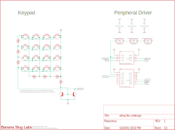

# tinyAVR Series-0/1 Multipurpose Peripheral

<table width="100%">
<tr>
<th></td>
<th></td>
</tr><tr>
<td>

Demo board of a key pad & RGB leds. The keypad uses
[Snaptron BL10280](https://www.snaptron.com/part-number/bl10280/) back lit
domes (the first switch is populated).

</td>
<td>

Keypad using [current mirror approach](https://github.com/sgmne/AnalogKeypad).

</td></tr>
</table>

## Purpose

I wanted a framework to build modular components in to my design. For example,
a controller dedicated to keypad input or a driver for those WS2812 LEDs. I
also wanted to see if I could exploit the AVR architecture to build a WS2812
driver using the hardware found in `ATTINY402` without resorting to bitbanging.

Ideally, you'd drop the chip in to your design, load the firmware, and
provision the settings in the EEPROM or custom firmware.

This was also a project where I explored certain methods for making the software
more modular with fewer inter-dependencies without the overhead.

## Status

### Features

  - LED Support: Yes (RGB888)
  - KeyPad: Analog (Preliminary)
  - Configurable Address: Yes
  - Sleep: Idle, Standby, Powerdown (Default: Standby)

## Documentation

 - [Protocol Details & Register File](docs/registers.md)
 - [Device Support & Implementation Details](docs/device-attiny40x.md) (currently specific to ATTint402)
 - [Test & Validation](docs/test-validation.md)
 - [Test Scripts](docs/test-scripts.md)
 - Build & Configuration (TBD)

## Parts

### Support Devices

  - `ATTINY402`
  - Future: `ATTINY40x`, `ATTINY8xx`, `ATTINY16xx`

### Incompatible Devices

  - ATTINY412
    Some tinyAVR Series-1 devices may be supported. `ATTINY412` does not have a
    LUT0 output. May have been able to use event system but this conflicts with
    I2C.

## Development Environment

  - MPLab X IDE 5.50
  - Compiler: GCC 7.4.0 (Arduino toolchain)
    - GCC 5.4, builds, but not tested.

## Reference Designs

See [ATTINY402](docs/device-attiny40x.md) details for more information.

### Future Work:

  - Encoders & keypads feature
    - Matrix Keypad, Simple Keypad
  - Improve Analog Keypad support
    - And KeyPad calibration stored in NVRAM
  - Fancy LED Encoding
    - Color spaces (RGB888, RGBW8888, RGB565, Pallet)
    - LED effects feature?
  - Improve EEPROM support to persist defaults (beyond device ID)
  - Transparent SPI bridge variant (direct SPI to WS2812 only)
  - Variant with other protocols like CAN Bus? (❤️ CAN!)
    - This really allows super fancy stuff.

## Contact Information

Feel free to contact opensource@bananasluglabs.com.

Please reach out to let me know if you find this useful or have included it in
a product or project.