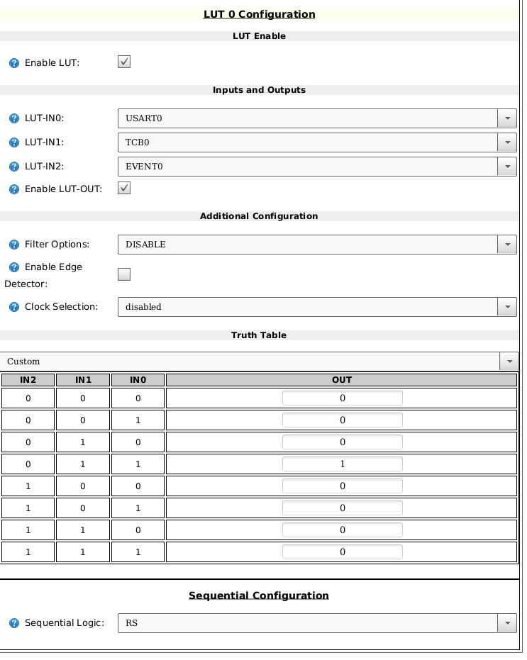

# tinyAVR Series-0/1 Multipurpose Peripheral


<table width="100%">
<tr>
<th></td>
<th></td>
</tr><tr>
<td>

Demo board of a key pad & RGB leds. The keypad uses
[Snaptron BL10280](https://www.snaptron.com/part-number/bl10280/) back lit
domes (the first switch is populated).

</td>
<td>

Keypad using [current mirror approach](https://github.com/sgmne/AnalogKeypad).

</td></tr>
</table>

## Purpose

I wanted a framework to build modular components in to my design. For example,
a controller dedicated to keypad input or a driver for those WS2812 LEDs. I
also wanted to see if I could exploit the AVR architecture to build a WS2812
driver using the hardware found in `ATTINY402` without resorting to bitbanging.

Ideally, you'd drop the chip in to your design, load the firmware, and
provision the settings in the EEPROM or custom firmware.

This was also a project where I explored certain methods for making the software
more modular with fewer inter-dependencies without the overhead.

## Status

### Features

  - LED Support: Yes (RGB888)
  - KeyPad: Analog (Preliminary)
  - Configurable Address: Yes

### Supported Devices

  - `ATTINY402`
  - Future: `ATTINY40x`, `ATTINY8xx`, `ATTINY16xx`

Incompatible Devices:
  - Some tinyAVR Series-1 devices may be supported. `ATTINY412` does not have a
    LUT0 output. May have been able to use event system but this conflicts with
    I2C.

### Future Work:

  - Encoders & keypads feature
    - Matrix Keypad, Simple Keypad
  - Improve Analog Keypad support
    - And KeyPad calibration stored in NVRAM
  - Fancy LED Encoding
    - Color spaces (RGB888, RGBW8888, RGB565, Pallet)
    - LED effects feature?
  - Improve EEPROM support to persist defaults (beyond device ID)
  - Transparent SPI bridge variant (direct SPI to WS2812 only)

## Test Script (using buspirate)

A test script is provided in `scripts/ledtest.py`. It uses BusPirate with a
[I2C clock stretching patch](https://github.com/BananaSlugLabs/Bus_Pirate).

## Register Files

**Note:** Accesses to this device will require clock stretching. If using a
BusPirate, one must patch the firmware to add support for clock stretching.

The default I2C address is 0x82.

Memory Map

- `0xF0:0xFF System Control Registers`
- `0x00:0x7F Mapped Memory Bank`

Banks

- `0: System Control Registers` (Always mapped to 0xF0 to 0xFF, but mappable to 0x00 to 0x0F.)
- `1: Device Information (Default)`
- `2: LED Peripheral`
- `3: KeyPad Peripheral`

### System Control Registers

```
Addr        Register            Default Value
--------------------------------------------------------------------------------
00          status              0
            See below...
01          txCommand           0
            When a transaction is completed this command will be executed.
            Used to, for example, trigger updating of the LEDs after memory
            writes. May also be executed using the command register below.
02          command             0
            Explicit command to be executed when writing to the control memory.
03:06       parameters          0
```

Status Register:

```
Bits        Field               Meaning
--------------------------------------------------------------------------------
0           Reserved
1           Bus Error           A command was already in progress. Reset when 
                                the after active command completes & a new one
                                is written.
4:7         Command Status      Used to determine the results of an executed
                                command.
                                0: Success
                                1: In Progress
                                2: Error - Busy
                                3: Error - Access
                                4: Error - Bad Command
                                5: Error - Bad Argument
```

#### System Control Commands

- `SetPage(1) page`
- `SetDeviceAddress(2) address`
- `Reset(3)`

### Device Information Registers

```
Addr        Register            Default Value
--------------------------------------------------------------------------------
00:01       mfg                 0xBA02
02:03       ident               0x2812
04:05       capabilities        (None Currently)
06          version             1
07          reserved
```

### LED Peripheral Registers

```
Addr        Register            Value
--------------------------------------------------------------------------------
00          controlA            0
            bit 0:              Update
            but 1:              Busy
01          controlB            (Not used)
02          count               CONFIG_LED_COUNT
03:n        LedData[GRB888 * count]
```

#### LED Commands

- `RefreshLed(8)`

### KeyPad Peripheral Registers

Keypad support is highly preliminary.


```
Addr        Register            Value
--------------------------------------------------------------------------------
00          status              Unused
01          ctrl                Unused
02          raw                 RAW ADC reading
03          key                 Key Index (0 == No Key Active)
04          state               KeyPad state machine.
                                (Dianostic only.)
05          candidate           RAW ADC Baseline value used for filtering/windowing
                                (Dianostic only.)
06          cal.threshold       Idle voltage reference value.
07          cal.offset          ADC value subtracted prior to calculation of the key index.
08          cal.vstep           Voltage step per key.
09          cal.filter          Number of successive samples needed prior to accepting key.
0A          cal.steadyState     Key is considered stable so long as it remains within this
                                windows (RAW +/- steadyState).
```

Default calibration is:
- Threshold: 0.9V
- Offset: 1V
- VStep: 260mV
- Filter: 64
- Steady State Window: +/- 0.0325V

This is appropriate for a 4x4 keypad constructed as described in
[sgmne's current sense keypad](https://github.com/sgmne/AnalogKeypad). This provides
a more linear result. Recommend keypads have solid read ground plane to reduce noise.

There is an CONFIG_KP_HISTORY option that changes this layout, but this feature was
used primarily to for testing.

See [this spreadsheet](assets/keypad_worksheet.ods) for a worksheet to help with
calibration.

#### KeyPad Commands

- None

## Device Support

### `ATTINY402` Information


*Figure: Reference design for `ATTINY402`.*


| Pin | Port | Function    | Usage                                             |
| --- | ---- | ----------- | --------------------------------------------------|
| 1   |      | VCC         | 5V                                                |
| 2   | PA6  | LUT0.OUT    | WS2812 Serial Waveform                            |
| 3   | PA7  | AIN7/AINP0  | Analog Keypad                                     |
| 4   | PA1  | TWI.SDA     | TWI (I2C) Data Signal                             |
| 5   | PA2  | TWI.SCL     | TWI (I2C) Clock Signal                            |
| 6   | PA0  | UPDI        | Debug interface.                                  |
| 7   | PA3  | USART.XCK   | USART XCK routed to pin to trigger evsys.         |
| 8   |      | GND         |                                                   |


Currently, the build only support `VDD` at 5V. Need to adjust clock for lower
voltages. Would need to reduce to 10MHz at 3.3V.

Pin 6: UPDI can be repurposed, but recommend leaving as-is.
Pin 7: XCK can be repurposed when USART is inactive.

## Test & Validation

See [test & validation](docs/test-validation.md) report.

## Implementation Notes

### KeyPad Notes

Initial pass is pretty preliminary. Reuses LUT1 output as analog input.

TODO:
  - Document keypad algorithm.

### WS2812 Notes

To support the WS2812, use the USART, Event System, CCL and TCB to generate the
appropriate WS2812 waveforms.

Although not shown in this project, one can extract the essential elements of
the WS2812 driver and make a transparent simple SPI to WS2812 bridge chip for
those who would rather directly drive the waveform from another microcontroller.

#### USART

The USART is configured in SPI mode. USART was selected primarily due to the
fractional baud rate. This provides more flexibility than the SPI peripheral.

The USART peripheral data register empty interrupt is selected as the **high
priority vector**. This is required to ensure timing constraints are met. The
implementation also supports updating with interrupts disabled. The `sys_abort`
leverages this to emit blinky fault lights.

The interrupt service routine takes approximately 1-2uSec to execute.

#### TCB

TCB timer is configured in single pulse mode that triggers on both edges of
SCK. TCB.WO is fed to the CCL to control the SR latch SET signal. The pulse is
200ns.


#### CCL

Implemented as a SET/RESET latch.

The latch is asserted when `!Event(TCB) & XCK & TCB.WO`.

The latch is cleared when `(Event(TCB) & USART.XCK & USART.TX) | (Event(TCB) & 
!USART.XCK)`. (This may be off. Need to revisit. See image below.)




#### Event System

`USART.XCK` is routed to PORTA3 which is then fed back in to the event system
to trigger TCB0. The CCL Event1 is not used and can be removed.


#### GPIO Restrictions

This implementation minimizes the PINs that are required to be allocated for
this purpose. The following restrictions apply:

  - PA3 XCK: Available when LEDs are not updating.
  - PA7 LUT1: Available
  - PA0 UPDI: When UPDI is not in use.

#### A word of warning...

This implementation relies on the I2C peripheral having a higher priority than
the USART peripheral since USART is shared with the I2C pins. This behavior
may work across multiple devices, but it relies on undocumented behavior of
the microcontroller. This approach cuts down on wasted IO pins, but it was also
necessary on the '402 chip as CCL and USART share pins. In that case, USART was
prioritized over CCL.

## Build Configuration Options

TBD

## Contact Information

Feel free to contact opensource@bananasluglabs.com.

Please reach out to let me know if you find this useful or have included it in
a product or project.